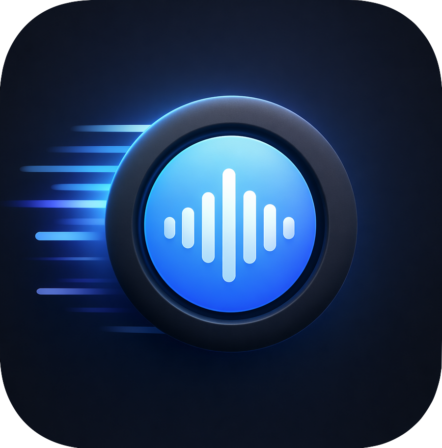

<h1> &nbsp;utter</h1>

[](https://github.com/jguice/utter/actions/workflows/ci.yml)
[](https://github.com/jguice/utter/actions/workflows/release.yml)

Local, no-cloud push-to-talk dictation for **macOS and Linux**. Hold a key, speak, release — the transcription appears in whatever text field is focused. Runs entirely on-device via [NVIDIA Parakeet-TDT 0.6B v3](https://huggingface.co/nvidia/parakeet-tdt-0.6b-v3) (INT8 ONNX) — no cloud, no API keys, no telemetry. ~150 ms for a 4-second utterance on a modern laptop CPU (~50× faster than real-time, measured on M2 Max).

## Quickstart

### macOS (Apple Silicon)

1. Download `utter-VERSION-macos-arm64.dmg` from the [latest release](https://github.com/jguice/utter/releases/latest). Open it, drag `utter.app` to `/Applications`.
2. Fetch the speech model (~650 MB, one-time):
   ```bash
   curl -fsSL https://raw.githubusercontent.com/jguice/utter/main/scripts/download-model.sh | bash
   ```
3. Launch `utter.app`. A first-run window walks you through three permission prompts (Microphone, Input Monitoring, Accessibility). The menu-bar icon appears once all three land.
4. Hold **Right Cmd (⌘)**, speak, release. Text pastes into your focused window.

**Change the PTT key:** open Terminal, run `/Applications/utter.app/Contents/MacOS/utter set-key`, press and hold the key you want, release. Cmd+Q the menu-bar icon and relaunch to apply.

### Linux (Fedora, RHEL, Rocky, Debian, Ubuntu — `x86_64` / `aarch64`)

```bash
curl -fsSL https://raw.githubusercontent.com/jguice/utter/main/scripts/install-release.sh | bash
```

Installs the matching `.rpm` / `.deb`, fetches the model, and starts the user services. Hold **Right Cmd / Right Super** (`rightmeta`), speak, release.

**Change the PTT key:** `utter set-key`, press the key you want, release. The watcher restarts automatically.

## Docs

- [Install](docs/INSTALL.md) — requirements, manual package install, from source, verify.
- [Configuration](docs/CONFIGURATION.md) — `config.toml`, env vars, PTT-key aliases, recording indicator.
- [Architecture](docs/ARCHITECTURE.md) — daemon/watcher on Linux, single-process on macOS.
- [Troubleshooting](docs/TROUBLESHOOTING.md)
- [Uninstall](docs/UNINSTALL.md)
- [AGENTS.md](AGENTS.md) — notes for coding agents running utter operations.

## Credits & license

MIT for the code. Parakeet-TDT 0.6B v3 is CC-BY-4.0 (NVIDIA; [model card](https://huggingface.co/nvidia/parakeet-tdt-0.6b-v3); ONNX conversion by [Ilya Stupakov](https://huggingface.co/istupakov/parakeet-tdt-0.6b-v3-onnx)). Inference via [`transcribe-rs`](https://github.com/cjpais/transcribe-rs) (MIT). Full attribution in [`NOTICE`](NOTICE). Starter contribution ideas in [`BACKLOG.md`](BACKLOG.md).
